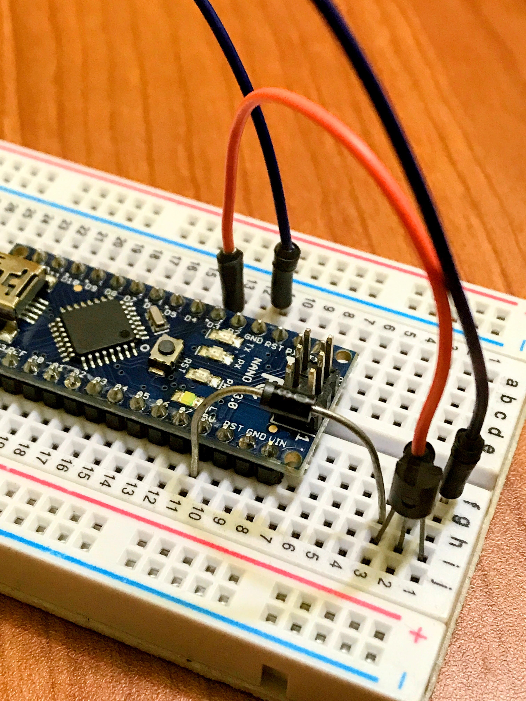

# Animatronic Rattlesnake Rattle Mechanism

This project is an **animatronic simulation of a rattlesnake rattle movement** using a **DC motor, a scotch yoke mechanism, and a rack and pinion gear system**. It accurately replicates the fast direction-changing oscillating rotational movement of a real rattlesnake rattle.

This setup was **3D modeled in Onshape CAD** and **3D printed** for a physical prototype. The purpose of this project is to serve as an **educational showcase** using an actual rattle from a deceased rattlesnake.

---

## 🔧 Hardware Components

- **Arduino Nano**
- **5V 600 RPM DC Motor**
- **NPN Transistor (TIP120, IRLZ34N, or 2N2222)**
- **1N4007 Diode**
- **Resistor (1KΩ)** (optional)

## 🔌 Wiring Guide

| **Component**      | **Connection**                        |
| ------------------ | ------------------------------------- |
| Motor +            | Arduino 5V                            |
| Motor -            | Transistor Collector                  |
| Transistor Base    | Arduino PWM Pin (D3) via 1KΩ resistor |
| Transistor Emitter | Arduino GND                           |
| 1N4007 Diode -     | Arduino 5V                            |
| 1N4007 Diode +     | Transistor Collector                  |

---

## 🖥️ Arduino Code

The **Arduino Nano** controls the motor with PWM signals to simulate the acceleration, deceleration, and rapid ON/OFF movements of a rattlesnake rattle.

### **Implemented Motion Sequences**

1. **Smooth Acceleration & Deceleration (`accel_decel1`)**
   - Ramps up from **0% to 100% in 0.5s**, holds for **4s**, and ramps down in **0.5s**.
2. **Drastic ON/OFF Pulsing (`accel_decel2`)**
   - Turns **ON at 100% for 1s**, then **OFF for 0.1s**, repeated **3 times**.
3. **Controlled Oscillation (`accel_decel3`)**
   - Smoothly **accelerates to 80% in 2s**, then **decelerates back to 0% in 2s**.

### **Code File**

The full Arduino code is in [`rattlesnake_rattle.ino`](rattlesnake_rattle.ino).

---

## 📜 Installation & Usage

### **1️⃣ Install Arduino IDE**

Download and install the **[Arduino IDE](https://www.arduino.cc/en/software)**.

### **2️⃣ Upload the Code**

1. Open **`rattlesnake_rattle.ino`** in Arduino IDE.
2. Select **Board: Arduino Nano**.
3. Select the correct **COM Port**.
4. Click **Upload**.

---

## 📸 Images & Videos

### **3D CAD Model (Onshape)**

### **GIF of the Working Mechanism**

### **Full Video**

[📹 Click to Watch](./video_demo.mp4)

---

## 📢 Acknowledgments

This project was developed entirely by me, @gary-vladimir for **educational purposes** to **replicate real-life animal motion in animatronics**.

---

## 🏷️ License

This project is open-source under the **MIT License**. Feel free to modify and improve!

---

## 📬 Contact

For any questions, reach out via:
**Email**: yragi.nunez@gmail.com  
**GitHub**: [gary-vladimir](https://github.com/gary-vladimir)
